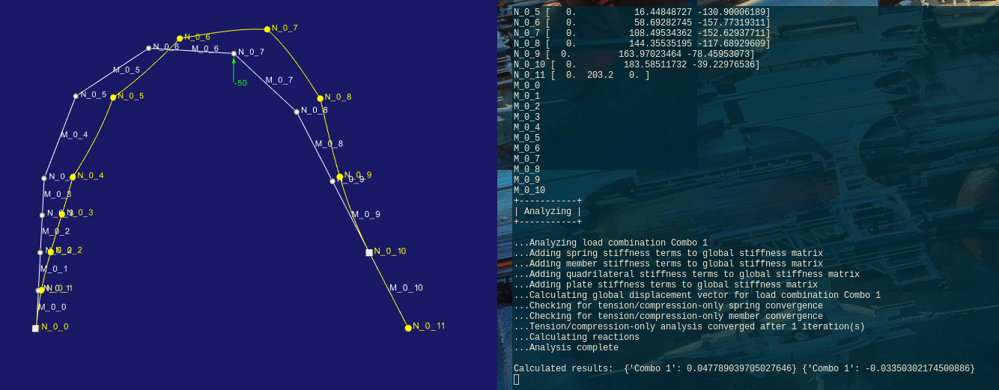

# Tubular
Tubeframe FE analyisis that doesn't suck. By "doesn't suck", what I mean is:
- Maintainable; allows you to re-import new geometry without re-selecting all entities
- Documented; allows you to make a "recipe" for how a frame is analyzed (or follow one of our examples)
- Exportable; allows you to do your own post-processing on a number of runs
- Delightful; gives you additional tools that you wouldn't easily have in other FE softwares
- Open; you've got full access to the innards if you really want to go there.

# How's it Going?

Well, I have loaded an IGES file, and I've meshed it, loaded it, and computed some results (are they right? idfk)

It's really manual and sucks, though. So that's not good.

# Dependencies
Python 3.7 with these packages:
[https://github.com/JWock82/PyNite](PyNite), which depends on
- numpy
- scipy
- matplotlib
- PrettyTable
- VTK (this one is annoying, but you'll want it for visualization)
[https://github.com/Thaddeus-Maximus/IGES-File-Reader](IGES-File-Reader), which depends on
- numpy
- matplotlib (sortof)

Conda may make installing some of these dependencies easier.
PyNite is not available from pip. The package pynite (lowercase) is for Fortnite... which isn't helpful.

# Struggles and Thoughts
pythonocc is not the right route for CAD import, so it seems. There's many KLOC yet noone seems to know how to actually extract information from entities...